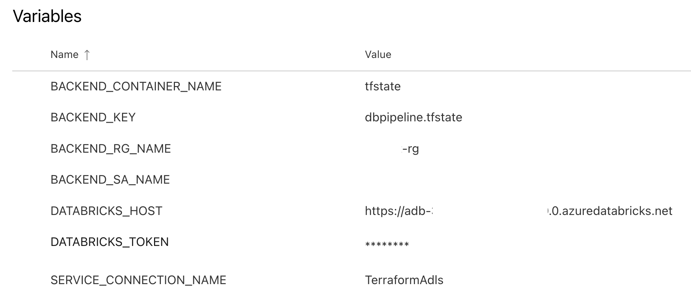
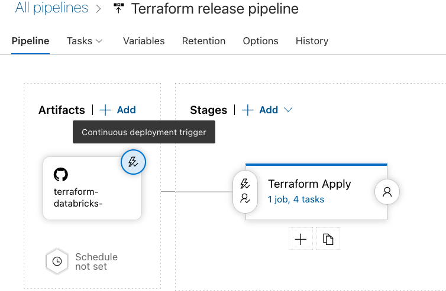

# manual-approve-with-azure-devops

This directory contains Terraform code that shows how to use [databricks-department-clusters](../../modules/databricks-department-clusters) to create Databricks resources, together with CI/CD pipeline that demonstrate how to validate pull request changes before applying them & using approvals before deploying changes to production system.  Please note that existing Terraform code is cross-platform and could be deployed to a Databricks workspace at any supported cloud.

## Workflow

The general workflow looks as following:


* Changes to the code in this directory or in the module are made in a separate Git branch & when changes are ready, a pull request is opened
* Upon opening of the pull request, the build pipeline is triggered, and following operations are performed:
  * Initializes Terraform using a remote backend to store a [Terraform state](https://www.terraform.io/language/state).
  * Perform check of the Terraform code for formatting consistency.
  * Performs check of the Terraform code using [terraform validate](https://www.terraform.io/cli/commands/validate).
  * Executes `terraform plan` to get the list changes that will be made during deployment.
* If the build pipeline is executed without errors, results of `terraform plan` and the code could be reviewed by reviewer, and merged into the `main` branch.
* When code is merged into the `main` branch, the release pipeline is triggered, and after a manual approval, changes are applied to the deployment using the `terraform apply` command.

As result of the pipeline execution, following resources will be created:

* A user group for a department with specific users added to it
* A shared Databricks cluster that could be used by users of the group
* A Databricks SQL Endpoint
* A Databricks cluster policy that could be used by the user group


### Configuring Terraform code

You can customize this project by modifying the `terraform.tfvars` file that defines following variables necessary for the `databricks-department-clusters` module:

* `cluster_name` - Name of the shared cluster to create
* `department` - Department name
* `group_name`|Name of the group to create|string||yes|
* `user_names` - List of users to create in the specified group
* `tags` - Additional tags applied to all resources created

## Configuring Azure DevOps pipelines

As described above, we need two pipelines:

* The build pipeline is responsible for validation of changes in pull requests.
* The release pipeline is responsible for deploying the changes.

We also need to define auxiliary objects in the Azure DevOps project that will be used by the both pipelines:

* Azure Data Lake Storage (ADLS) account and container that will be used to store Terraform state.
* Service connection for Github that will be used to detect the changes in the repository (not necessary if you use Azure DevOps Repos).
* [Service connection for Azure Resource Manager](https://docs.microsoft.com/en-us/azure/devops/pipelines/library/service-endpoints?view=azure-devops&tabs=yaml#azure-resource-manager-service-connection) that will be used to access data of Terraform state in Azure Data Lake Storage (ADLS) container via [azure remote backend](https://www.terraform.io/language/settings/backends/azurerm).  The configured identity needs to have write access to the configured ADLS container.
* [Azure DevOps variable group](https://docs.microsoft.com/en-us/azure/devops/pipelines/library/variable-groups) will store all variables used by the both pipelines.

### Configuring the variable group

We need to configure a variable group with the name `TerraformProdDeploy`.  It should contain following variables:

* `BACKEND_RG_NAME` - name of resource group containing storage account.
* `BACKEND_SA_NAME` - name of the storage account.
* `BACKEND_CONTAINER_NAME` - name of the container inside the storage account.
* `BACKEND_KEY` - name of the blob (file) object that will be used to store the Terraform state of our deployment.
* `SERVICE_CONNECTION_NAME` - name of the Azure DevOps service connection for Azure Resource Manager that was defined earlier.
* `DATABRICKS_HOST` - URL of the Databricks workspace where resources will be deployed.
* `DATABRICKS_TOKEN` - personal access token for the Databricks workspace (follow [documentation](https://docs.databricks.com/dev-tools/api/latest/authentication.html) for instructions on how to obtain it).  Please mark this variable as **secret** to avoid exposing its value.

The configured variable group should see as following:




### Configuring the build pipeline

Create a build pipeline by navigating to the "Pipelines" section of your Azure DevOps project, and click "New pipeline" that will walk you through configuration:

* Select Git repository with the code
* Select the "Existing Azure Pipelines YAML file" option, and select `/environments/manual-approve-with-azure-devops/azure-pipelines.yml` from the dropdown
* Select "Save" from the dropdown in the "Run" button

This will create a new build pipeline that will be triggered on the pull request to the `main` branch & validate proposed changes.


### Configuring the release pipeline

Create a release pipeline by navigating to the "Releases" in the "Pipelines" section of your Azure DevOps project, and select "New release pipeline" from the "New" dropdown.  We won't use any existing template, so close the dialog on the right.

We need to define two things:

1. Artifact that will be used to trigger the release pipeline.
1. Stage that will be executed as part of the release.

At the end your release pipeline should look as following (don't forget to press "Save" after configuration is done):




#### Configuring release artifact

Release artifact is configured as following:

* Click on the "Add an artifact" button, then select your Git implementation (GitHub, Azure DevOps, ...), and select a repository with the code.
* Select the default branch - set it to `main`
* Set the "Default version" field to value "Latest from the default branch"
* Set the "Source alias" field to something easy to remember - we'll use that value in the stages.  For example, `terraform-databricks-pipeline`
* Click on the "⚡" icon to configure the continuous deployment (by default, release is triggered manually). Toggle the "Enabled" switch, add the branch filter and also select the `main` branch

#### Configuring the stage of the release pipeline

Configure stage by pressing "Add a stage":

* Select "Empty Job" in the dialog
* In the Stage dialog enter some meaningful name for it
* In the "Variables" tab, link the variable group that was created previously
* Switch to Tasks tab to configure agent - select "Azure pipelines" in the "Agent pool", and in the "Agent Specification" select "ubuntu-latest"
* Use "+" on the "Agent job" to add tasks. We need to define 4 tasks:

1. Task that will be used to install Terraform. Search for "Command line" task and add it.  Give it name like "Install Terraform" and enter following code into the "Script" field:

```sh
brew tap hashicorp/tap
brew install hashicorp/tap/terraform
```


2. Task that will extract necessary data for authentication against the state backend. Search for "Azure CLI" task and add it.  Give it name like "Extract information from Azure CLI", and set parameters as following:

  * Select your service connection in "Azure Resource Manager connection" dropdown
  * In "Script Type" select "Shell"
  * In "Script Location" select "Inline script"
  * Make sure that "Access service principal details in script" is checked
  * Put following into "Inline Script" text block:

  ```sh
  subscription_id=$(az account list --query "[?isDefault].id"|jq -r '.[0]')
  echo "##vso[task.setvariable variable=ARM_CLIENT_ID]${servicePrincipalId}"
  echo "##vso[task.setvariable variable=ARM_CLIENT_SECRET;issecret=true]${servicePrincipalKey}"
  echo "##vso[task.setvariable variable=ARM_TENANT_ID]${tenantId}"
  echo "##vso[task.setvariable variable=ARM_SUBSCRIPTION_ID]${subscription_id}"
  ```

3. Task to perform initialization of Terraform using the state in the remote backend. Search for Command line" task, add it, and configure following parameters:

  * Put `$(System.DefaultWorkingDirectory)/terraform-databricks-pipeline/environments/manual-approve-with-azure-devops` into the "Working Directory" field under "Advanced" block (`terraform-databricks-pipeline` is the value of the "Source alias" that we defined in Artifact.
  * Add environment variable with name `ARM_CLIENT_SECRET` and value `$(ARM_CLIENT_SECRET)`
  * Put following code into "Script" field:

  ```sh
  terraform init -input=false -no-color \
    -backend-config="resource_group_name=$BACKEND_RG_NAME" \
    -backend-config="storage_account_name=$BACKEND_SA_NAME" \
    -backend-config="container_name=$BACKEND_CONTAINER_NAME" \
    -backend-config="key=$BACKEND_KEY"
  ```

4. Task to apply changes. Search for Command line" task, add it, and configure following parameters:

  * Put `$(System.DefaultWorkingDirectory)/terraform-databricks-pipeline/environments/manual-approve-with-azure-devops` into the "Working Directory" field under "Advanced" block (`terraform-databricks-pipeline` is the value of the "Source alias" that we defined in Artifact.
  * Add two environment variables. One with name `ARM_CLIENT_SECRET` and value `$(ARM_CLIENT_SECRET)`, and another with name `DATABRICKS_TOKEN` and value `$(DATABRICKS_TOKEN)`
  * Put following code into "Script" field:

  ```sh
  terraform apply -input=false -no-color
  ```


The final step of the configuration for release pipeline is configuration of approvals.  Click on the "⚡", select the "After release" trigger, and then toggle the "Pre-deployment approvals" button. Put names of the approvers into the "Approvers" box - they will get notification when release is triggered, and they will need to approve deployment of the changes.
