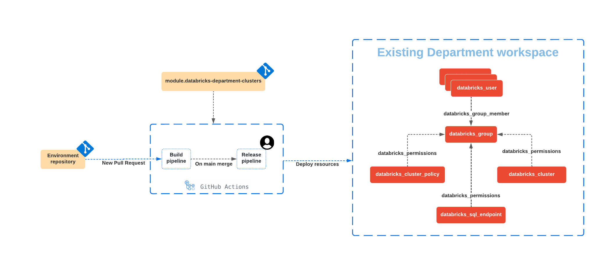
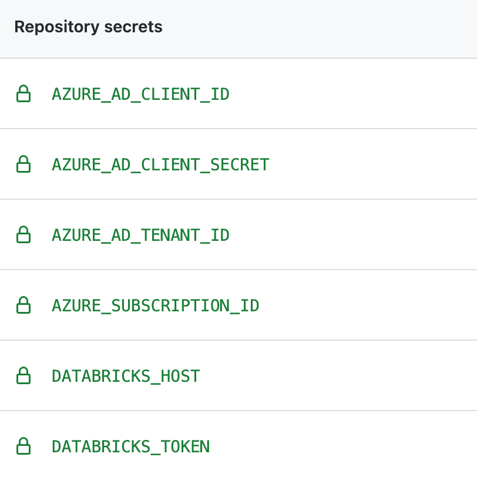

# manual-approve-with-github-actions

This directory contains Terraform code that shows how to use [databricks-department-clusters](../../modules/databricks-department-clusters) to create Databricks resources, together with CI/CD pipeline that demonstrate how to validate pull request changes before applying them & using approvals before deploying changes to production system.  Please note that existing Terraform code is cross-platform and could be deployed to a Databricks workspace at any supported cloud.

## Workflow

The general workflow looks as following:

* Changes to code in this directory or in the module are made in a separate Git branch & when changes are ready, a pull request is opened
* Upon opening of the pull request, the build pipeline is triggered, and following operations are performed:
  * Initializes Terraform using a remote backend to store a [Terraform state](https://www.terraform.io/language/state).
  * Perform check of the Terraform code for formatting consistence.
  * Performs check of the Terraform code using [terraform validate](https://www.terraform.io/cli/commands/validate).
  * Executes `terraform plan` to get the list changes that will be made.
* If build pipeline executed without errors, results of `terraform plan` and code could be reviewed by reviewer, and merged into the `main` branch.
* When code is merged into the `main` branch, the release pipeline is triggered, and after a manual approval, changes are applied to the deployment using the `terraform apply` command.

As result of the pipeline execution, following resources will be created:

* A user group for a department with specific users added to it
* A shared Databricks cluster that could be used by users of the group
* A Databricks SQL Endpoint
* A Databricks cluster policy that could be used by the user group

### Configuring Terraform code

You can customize this project by modifying the `terraform.tfvars` file that defines following variables necessary for the `databricks-department-clusters` module:

* `cluster_name` - Name of the shared cluster to create
* `department` - Department name
* `group_name`|Name of the group to create|string||yes|
* `user_names` - List of users to create in the specified group
* `tags` - Additional tags applied to all resources created

## Configuring Github Actions pipeline

As described above, we need two jobs in the Github actions workflow:

* Build job is responsible for validation of changes in pull request. It is triggered by any new pull request event on the `main` branch.
* Release job is responsible for deploying the changes:
  * It is triggered by any new merge event on the `main` branch.
  * It requires a manual approval before deploying the changes. See [Configuring the Github Actions release job](#configuring-the-github-actions-release-job) for more details.

In order to use this pipeline, we have two prerequisites:

* Create a Service Principale and grant it one of the following permissions:
  * Contributor access to the Azure Databricks workspace and blob contributor access to the storage account used for the remote state. 
  * Contributor access to the resource group containing both the Azure Databricks workspace and the storage account. 
* Store credentials for the Service Principale and the Databricks workspace where ressources will be deployed.

### List of Github Actions secrets

We need to define the following secrets:

* `DATABRICKS_HOST` - URL of the Databricks workspace where resources will be deployed.
* `DATABRICKS_TOKEN` - personal access token for the Databricks workspace (follow [documentation](https://docs.databricks.com/dev-tools/api/latest/authentication.html) for instructions on how to obtain it).
* `AZURE_AD_CLIENT_ID` – ID of the Azure service principal.
* `AZURE_AD_CLIENT_SECRET` – Secret of the Azure Service Principal.
* `AZURE_AD_TENANT_ID` – Azure AD tenant ID to where the service principal was created.
* `AZURE_SUBSCRIPTION_ID` – Subscription ID of where you want to deploy the Terraform
* `BACKEND_RG_NAME` - name of resource group containing storage account.
* `BACKEND_SA_NAME` - name of the storage account.
* `BACKEND_CONTAINER_NAME` - name of the container inside the storage account.
* `BACKEND_KEY` - name of the blob (file) object that will be used to store Terraform state of our deployment.

### Configuring the Github Actions workflow 

In order to create a new Github Actions workflow, follow these steps:

* Create a .github/workflows directory in your repository on GitHub if this directory does not already exist.
* In the .github/workflows directory, create a file named terraform-databricks-demo.yml.
* Copy the [github-actions.yml](github-actions.yml) into the ``terraform-databricks-demo.yml`` file.
* Commit and push your changes to the `main` branch. This will automatically create a new Github Actions workflow. 

### Configuring the Github Actions release job

The release job requires a manual approval before deploying the changes. Once the reviewers approve the request, the release job will start deploying the changes.
In order to configure the manual approval, follow these steps:

* On GitHub.com, navigate to the main page of the repository and click "Settings".
* In the left sidebar, click Environments and click "New environment".
* Name the environment `production`. This name is used in the [github-actions.yml](github-actions.yml) file.
* Specify people or teams that must approve release job.
