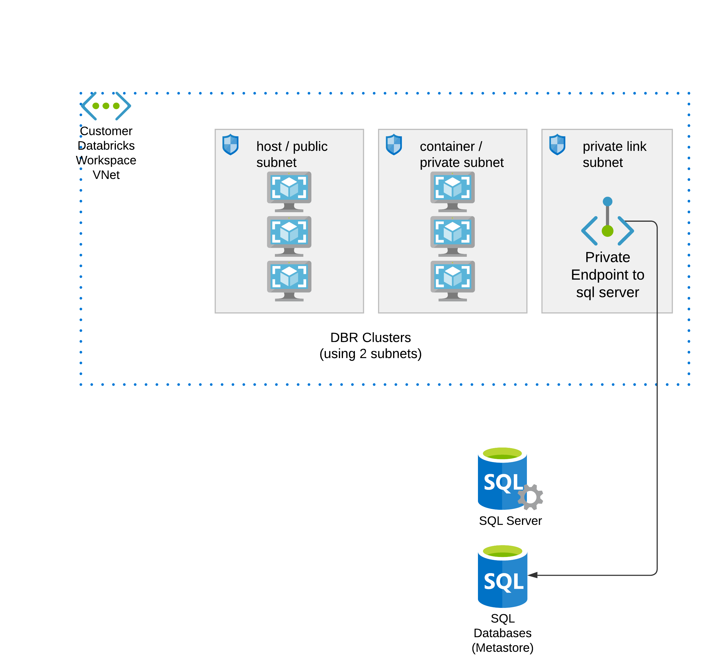

# ADB workspace with external hive metastore

Credits to alexey.ott@databricks.com and bhavin.kukadia@databricks.com for notebook logic for database initialization steps.
This architecture will be deployed:



# Get Started:
On your local machine, inside this folder of `adb-external-hive-metastore`:

1. Clone the `tf_azure_deployment` repository to local.
2. Supply with your `terraform.tfvars` file to overwrite default values accordingly. See inputs section below on optional/required variables.
3. For step 2, variables for db_username and db_password, you can also use your environment variables: terraform will automatically look for environment variables with name format TF_VAR_xxxxx.

    `export TF_VAR_db_username=yoursqlserveradminuser`

    `export TF_VAR_db_password=yoursqlserveradminpassword`
4. Init terraform and apply to deploy resources:
    
    `terraform init`
    
    `terraform apply`

Step 4 automatically completes 99% steps. The last 1% step is to manually trigger the deployed job to run once.

Go to databricks workspace - Job - run the auto-deployed job only once; this is to initialize the database with metastore schema.


Then you can verify in a notebook:


We can also check inside the sql db (metastore), we've successfully linked up cluster to external hive metastore and registered the table here:


Now you can config all other clusters to use this external metastore, using the same spark conf and env variables of cold start cluster.


### Notes: Migrate from your existing managed metastore to external metastore

Refer to tutorial: https://kb.databricks.com/metastore/create-table-ddl-for-metastore.html

```python
dbs = spark.catalog.listDatabases()
for db in dbs:
    f = open("your_file_name_{}.ddl".format(db.name), "w")
    tables = spark.catalog.listTables(db.name)
    for t in tables:
        DDL = spark.sql("SHOW CREATE TABLE {}.{}".format(db.name, t.name))
        f.write(DDL.first()[0])
        f.write("\n")
    f.close()
```


<!-- BEGIN_TF_DOCS -->
Module creates:
* Resource group with random prefix
* Tags, including `Owner`, which is taken from `az account show --query user`
* VNet with public and private subnet
* Databricks workspace
* External Hive Metastore for ADB workspace
* Private endpoint connection to external metastore

## Requirements

| Name                                                                         | Version |
| ---------------------------------------------------------------------------- | ------- |
| <a name="requirement_azurerm"></a> [azurerm](#requirement\_azurerm)          | =2.83.0 |
| <a name="requirement_databricks"></a> [databricks](#requirement\_databricks) | 0.3.10  |

## Providers

| Name                                                                   | Version |
| ---------------------------------------------------------------------- | ------- |
| <a name="provider_azurerm"></a> [azurerm](#provider\_azurerm)          | 2.83.0  |
| <a name="provider_databricks"></a> [databricks](#provider\_databricks) | 0.3.10  |
| <a name="provider_external"></a> [external](#provider\_external)       | 2.1.0   |
| <a name="provider_random"></a> [random](#provider\_random)             | 3.1.0   |

## Modules

No modules.

## Resources

| Name                                                                                                                                                                                            | Type        |
| ----------------------------------------------------------------------------------------------------------------------------------------------------------------------------------------------- | ----------- |
| [azurerm_databricks_workspace.this](https://registry.terraform.io/providers/hashicorp/azurerm/2.83.0/docs/resources/databricks_workspace)                                                       | resource    |
| [azurerm_key_vault.akv1](https://registry.terraform.io/providers/hashicorp/azurerm/2.83.0/docs/resources/key_vault)                                                                             | resource    |
| [azurerm_key_vault_access_policy.example](https://registry.terraform.io/providers/hashicorp/azurerm/2.83.0/docs/resources/key_vault_access_policy)                                              | resource    |
| [azurerm_key_vault_secret.hivepwd](https://registry.terraform.io/providers/hashicorp/azurerm/2.83.0/docs/resources/key_vault_secret)                                                            | resource    |
| [azurerm_key_vault_secret.hiveurl](https://registry.terraform.io/providers/hashicorp/azurerm/2.83.0/docs/resources/key_vault_secret)                                                            | resource    |
| [azurerm_key_vault_secret.hiveuser](https://registry.terraform.io/providers/hashicorp/azurerm/2.83.0/docs/resources/key_vault_secret)                                                           | resource    |
| [azurerm_mssql_database.sqlmetastore](https://registry.terraform.io/providers/hashicorp/azurerm/2.83.0/docs/resources/mssql_database)                                                           | resource    |
| [azurerm_mssql_server.metastoreserver](https://registry.terraform.io/providers/hashicorp/azurerm/2.83.0/docs/resources/mssql_server)                                                            | resource    |
| [azurerm_mssql_server_extended_auditing_policy.mssqlpolicy](https://registry.terraform.io/providers/hashicorp/azurerm/2.83.0/docs/resources/mssql_server_extended_auditing_policy)              | resource    |
| [azurerm_mssql_virtual_network_rule.sqlservervnetrule](https://registry.terraform.io/providers/hashicorp/azurerm/2.83.0/docs/resources/mssql_virtual_network_rule)                              | resource    |
| [azurerm_network_security_group.this](https://registry.terraform.io/providers/hashicorp/azurerm/2.83.0/docs/resources/network_security_group)                                                   | resource    |
| [azurerm_private_dns_zone.dnsmetastore](https://registry.terraform.io/providers/hashicorp/azurerm/2.83.0/docs/resources/private_dns_zone)                                                       | resource    |
| [azurerm_private_dns_zone_virtual_network_link.metastorednszonevnetlink](https://registry.terraform.io/providers/hashicorp/azurerm/2.83.0/docs/resources/private_dns_zone_virtual_network_link) | resource    |
| [azurerm_private_endpoint.sqlserverpe](https://registry.terraform.io/providers/hashicorp/azurerm/2.83.0/docs/resources/private_endpoint)                                                        | resource    |
| [azurerm_resource_group.this](https://registry.terraform.io/providers/hashicorp/azurerm/2.83.0/docs/resources/resource_group)                                                                   | resource    |
| [azurerm_storage_account.sqlserversa](https://registry.terraform.io/providers/hashicorp/azurerm/2.83.0/docs/resources/storage_account)                                                          | resource    |
| [azurerm_subnet.plsubnet](https://registry.terraform.io/providers/hashicorp/azurerm/2.83.0/docs/resources/subnet)                                                                               | resource    |
| [azurerm_subnet.private](https://registry.terraform.io/providers/hashicorp/azurerm/2.83.0/docs/resources/subnet)                                                                                | resource    |
| [azurerm_subnet.public](https://registry.terraform.io/providers/hashicorp/azurerm/2.83.0/docs/resources/subnet)                                                                                 | resource    |
| [azurerm_subnet.sqlsubnet](https://registry.terraform.io/providers/hashicorp/azurerm/2.83.0/docs/resources/subnet)                                                                              | resource    |
| [azurerm_subnet_network_security_group_association.private](https://registry.terraform.io/providers/hashicorp/azurerm/2.83.0/docs/resources/subnet_network_security_group_association)          | resource    |
| [azurerm_subnet_network_security_group_association.public](https://registry.terraform.io/providers/hashicorp/azurerm/2.83.0/docs/resources/subnet_network_security_group_association)           | resource    |
| [azurerm_virtual_network.sqlvnet](https://registry.terraform.io/providers/hashicorp/azurerm/2.83.0/docs/resources/virtual_network)                                                              | resource    |
| [azurerm_virtual_network.this](https://registry.terraform.io/providers/hashicorp/azurerm/2.83.0/docs/resources/virtual_network)                                                                 | resource    |
| [databricks_cluster.coldstart](https://registry.terraform.io/providers/databrickslabs/databricks/0.3.10/docs/resources/cluster)                                                                 | resource    |
| [databricks_global_init_script.metastoreinit](https://registry.terraform.io/providers/databrickslabs/databricks/0.3.10/docs/resources/global_init_script)                                       | resource    |
| [databricks_job.metastoresetup](https://registry.terraform.io/providers/databrickslabs/databricks/0.3.10/docs/resources/job)                                                                    | resource    |
| [databricks_notebook.ddl](https://registry.terraform.io/providers/databrickslabs/databricks/0.3.10/docs/resources/notebook)                                                                     | resource    |
| [databricks_secret_scope.kv](https://registry.terraform.io/providers/databrickslabs/databricks/0.3.10/docs/resources/secret_scope)                                                              | resource    |
| [random_string.naming](https://registry.terraform.io/providers/hashicorp/random/latest/docs/resources/string)                                                                                   | resource    |
| [azurerm_client_config.current](https://registry.terraform.io/providers/hashicorp/azurerm/2.83.0/docs/data-sources/client_config)                                                               | data source |
| [databricks_current_user.me](https://registry.terraform.io/providers/databrickslabs/databricks/0.3.10/docs/data-sources/current_user)                                                           | data source |
| [databricks_node_type.smallest](https://registry.terraform.io/providers/databrickslabs/databricks/0.3.10/docs/data-sources/node_type)                                                           | data source |
| [databricks_spark_version.latest_lts](https://registry.terraform.io/providers/databrickslabs/databricks/0.3.10/docs/data-sources/spark_version)                                                 | data source |
| [external_external.me](https://registry.terraform.io/providers/hashicorp/external/latest/docs/data-sources/external)                                                                            | data source |

## Inputs

| Name                                                                                                           | Description                                                   | Type     | Default           | Required |
| -------------------------------------------------------------------------------------------------------------- | ------------------------------------------------------------- | -------- | ----------------- | :------: |
| <a name="input_cold_start"></a> [cold\_start](#input\_cold\_start)                                             | if true, will spin up a cluster to download hive jars to dbfs | `bool`   | `true`            |    no    |
| <a name="input_db_password"></a> [db\_password](#input\_db\_password)                                          | Database administrator password                               | `string` | n/a               |   yes    |
| <a name="input_db_username"></a> [db\_username](#input\_db\_username)                                          | Database administrator username                               | `string` | n/a               |   yes    |
| <a name="input_dbfs_prefix"></a> [dbfs\_prefix](#input\_dbfs\_prefix)                                          | n/a                                                           | `string` | `"dbfs"`          |    no    |
| <a name="input_no_public_ip"></a> [no\_public\_ip](#input\_no\_public\_ip)                                     | n/a                                                           | `bool`   | `true`            |    no    |
| <a name="input_private_subnet_endpoints"></a> [private\_subnet\_endpoints](#input\_private\_subnet\_endpoints) | n/a                                                           | `list`   | `[]`              |    no    |
| <a name="input_rglocation"></a> [rglocation](#input\_rglocation)                                               | n/a                                                           | `string` | `"southeastasia"` |    no    |
| <a name="input_spokecidr"></a> [spokecidr](#input\_spokecidr)                                                  | n/a                                                           | `string` | `"10.179.0.0/20"` |    no    |
| <a name="input_sqlvnetcidr"></a> [sqlvnetcidr](#input\_sqlvnetcidr)                                            | n/a                                                           | `string` | `"10.178.0.0/20"` |    no    |
| <a name="input_workspace_prefix"></a> [workspace\_prefix](#input\_workspace\_prefix)                           | n/a                                                           | `string` | `"adb"`           |    no    |

## Outputs

| Name                                                                                                                                                           | Description |
| -------------------------------------------------------------------------------------------------------------------------------------------------------------- | ----------- |
| <a name="output_arm_client_id"></a> [arm\_client\_id](#output\_arm\_client\_id)                                                                                | n/a         |
| <a name="output_arm_subscription_id"></a> [arm\_subscription\_id](#output\_arm\_subscription\_id)                                                              | n/a         |
| <a name="output_arm_tenant_id"></a> [arm\_tenant\_id](#output\_arm\_tenant\_id)                                                                                | n/a         |
| <a name="output_azure_region"></a> [azure\_region](#output\_azure\_region)                                                                                     | n/a         |
| <a name="output_databricks_azure_workspace_resource_id"></a> [databricks\_azure\_workspace\_resource\_id](#output\_databricks\_azure\_workspace\_resource\_id) | n/a         |
| <a name="output_resource_group"></a> [resource\_group](#output\_resource\_group)                                                                               | n/a         |
| <a name="output_workspace_url"></a> [workspace\_url](#output\_workspace\_url)                                                                                  | n/a         |
<!-- END_TF_DOCS -->