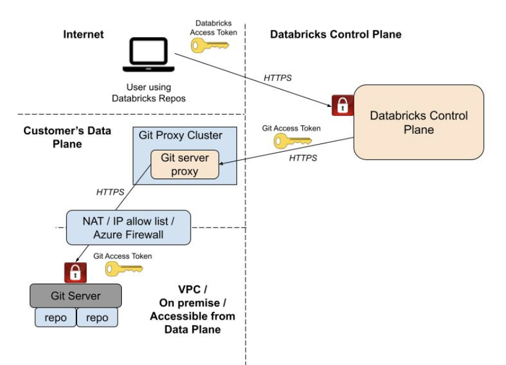
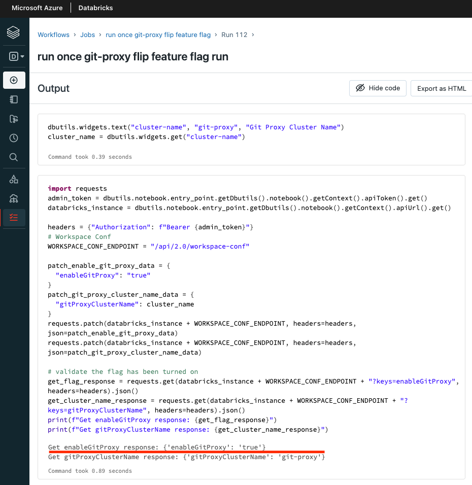

# On-prem Git Servers (Github Enterpise Onprem, Bitbucket Server etc.) with Azure Databricks

```
This is an automated terraform template to deploy Databricks workspace and a single-node cluster that will relay control plane git traffic to on-prem git server.
```

From the official doc on ADB repos: https://docs.microsoft.com/en-us/azure/databricks/repos/, there's no direct support for on-prem git servers. This is because git operations are initiated from the control plane (think about the moment you push from UI); and the Databricks control plane does not have direct connection to your onprem git server. 

As of 202208, the long-term private link based solution for onprem git servers is still in development; for the near future, we only have this git proxy based solution for onprem git servers; this terraform pattern is the adaption from the work of hj.suh@databricks.com, and serves as the reference implementation of git proxy.

```
See the original git proxy work from https://gist.github.com/hjsuh18/4805b5c3dfe3aa1bbabc250a98cb89a2
```

## Overall Architecture



This template deploys the vanilla version of Databricks workspace in managed VNet into a new resource group, a single-node Databricks cluster as git proxy, and a Databricks job that needs to be run once to flip the git proxy feature flag for the workspace via workspace 2.0 API call. All the necessary scripts have been provided in `scripts` folder and it's customer's duty to maintain these scripts logic. 


## Getting started

### Step 1:

Clone this repo to your local, and make sure you have installed Terraform on your machine. See https://learn.hashicorp.com/tutorials/terraform/install-cli on how to install terraform on your machine.

### Step 2:

Navigate to this folder `/adb-git-proxy`, run `terraform init` and `terraform apply` then type yes when prompted. This will deploy the infra to your Azure subscription, specifically it deploys a resource group, a NPIP Databricks workspace, a single-node cluster as your proxy for this workspace, a databricks job.

### Step 3:

Log into your workspace, find the job deployed, run it only once, check after successful run, you should see the git proxy feature flag flipped. As shown in sample picture below.


