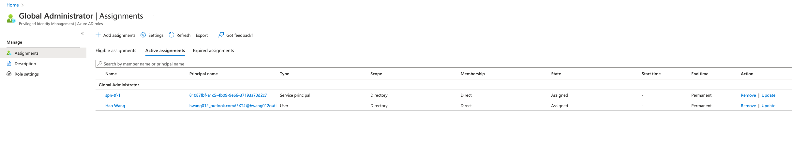

### Stage 1 Generate a Global Admin SPN

In Stage 1, we use `az login` authentication with a **user principal** to `azuread` and `azurerm` providers (you can also log in as a service principal) to create an AAD Global Admin SPN. The user principal / servicipal you use to authenticate with Stage 1 must be able to grant AAD Global Admin role to other users/SPNs.

Stage 1 deployment steps:

On your local machine, run the following commands to log in with your user principal interactively:
```bash
az login
```

or az login with an existing SPN that's able to grant other SPNs AAD Global Admin role, you can log in as a service principal like below:
```bash
az login --service-principal -u <app-id> -p <password-or-cert> --tenant <tenant>
```

In this stage 1 folder, run
```bash
terraform init & terraform apply
```
This deploys a new SPN and grant it as AAD Global Admin. You should see under AAD - Roles - Global Admin, with the new assignment to SPN like below:



This completes Stage 1.