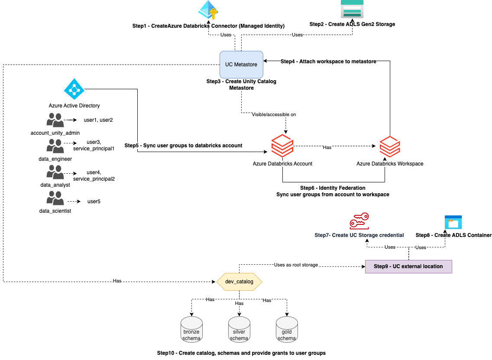

# Azure Databricks End to End Unity Catalog Implementation

This Terraform project is deploying all the resources needed to properly setup unity catalog for azure databricks governance. We are essentially deploying all the resources shown in the diagram below:

- Step1: Deploy Azure databricks managed identity connector to be used by the metastore to access its root storage.
- Step2: Deploy ADLS Gen2 storage account to be used by the metastore as root storage.
- Step3: Deploy the unity catalog metastore.
- Step4: Attached the existing databricks workspace to metastore to enable unity catalog for the workspace.
- Step5: Sync AAD groups to Databricks account. For this steps groups (and their member users, service principals) should have already been created beforehand in AAD.
  - Note that in our example `account_unity_admin` group becomes the metastore admin, workspace admin and owner of all unity catalog objects (catalog, storage cred, external location and schemas).
  - `account_unity_admin` also becomes Databricks account admin.
  - Therefore, the user or principal running this example template should be a member of `account_unity_admin` group to successfully deploy all resources.
- Step6: Sync user groups from account to workspace, this is also called identity federation.
- Step7: Deploy a storage credential (encapsulating managed identity created in step1) to be used to create an external location.
- Step8: Create a separate storage container to be used by `dev_catalog` as root storage for its managed tables.
- Step9: Deploy an external location pointing to the container in step8.
- Step10: Deploy dev_catalog for dev environment, 3 schemas (for bronze, silver and gold layers) and grant different groups different set of permissions on catalog and schemas.

## Run the following terraform commands to deploy (in the order)

Before running the terraform commands, replace the following placeholders in `terraform.tfvars` file with real values:
- databricks-account-id
- subscription-id
- resource-group-name
- workspace-name

And you might have different AAD group names than the ones used in this example. Therefore, please also change value for `aad_groups` variable in `terraform.tfvars` file. _Make sure you create the desired user groups and add user/service principal members to them in AAD before running this template._

_Note:_ We have used `account_unity_admin` group as metastore admin, workspace admin and owner of unity catalog objects. It would be better that you create an AAD group with the same name for admins. Otherwise, you would need to update the `main.tf` files as they use this group name as filter value while applying the permissions and ownerships. Similarly, `data_engineer`, `data_analyst`, and `data_scientist` AAD group names are also used in the `main.tf` file at root level to grant permissions to catalog and schema, so if you use different AAD group names then don't forget to make changes in the template accordingly. 

And now you can run the following terraform command to deploy unity catalog setup:

1. `terraform init`
2. `terraform validate`
3. `terraform apply -target=module.metastore_and_users`
4. `terraform apply`

_Note:_ We need to run terraform apply into 2 part here because to add users to their group membership, will need to dynamically pull the members of each group into a for_each loop and recent version of Terraform don't allow to use values derived from resource attributes that cannot be determined until apply. Therefore, as a work-around we just run the target module (metastore_and_users) to first deploy metastore, users and groups and then we run a separate terraform apply to deploy remaining resources including the user to group membership. With a CI/CD in place we can easily automate these commands in required order.
