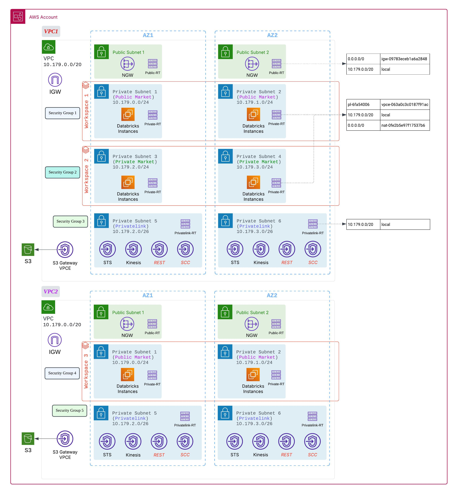
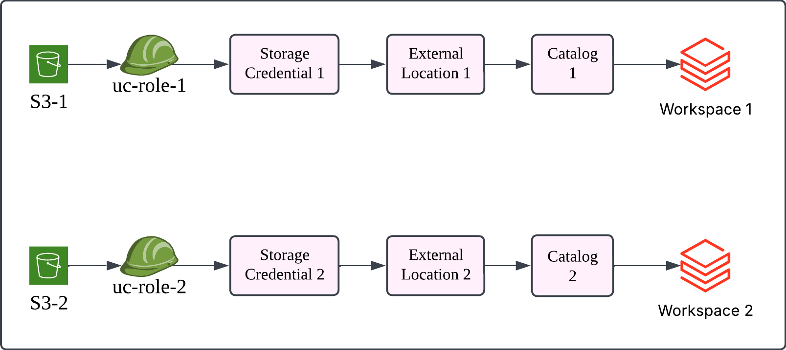
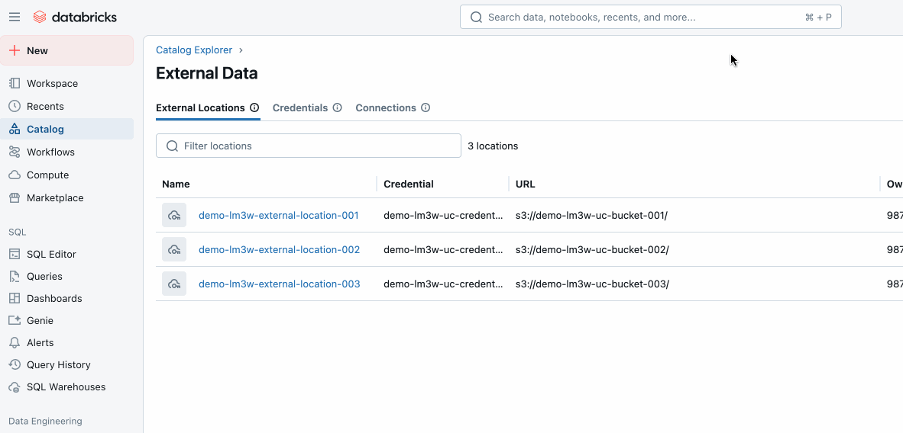

Config-driven AWS Databricks Workspaces deployment
=========================

This example provides a config-driven approach to deploy AWS Databricks environments, including AWS Infra, Databricks workspaces, and UC catalogs. This example takes references from Databricks SRA template [https://github.com/databricks/terraform-databricks-sra/tree/main].

You can easily deploy:
1. Multiple VPC as dedicated environments, with each VPC hosting multiple Databricks workspaces compute plane.
2. All workspaces will use Databricks backend private link, CMK.
3. Multiple UC catalogs with dedicated IAM role and External Locations, S3 for storing datasets into isolated infra. 

## Architecture



## Getting Started

We provide 2 pipelines to deploy: 
- Account level resources (e.g. workspaces, metastore, identities).
- Workspace level resources (e.g. clusters), UC resources (e.g. catalogs, external locations) are deployed using workspace level provider.

You can separate out these 2 pipelines into different projects, instead of keeping everything in the same repo folder.

> Step 1.1: Manually create a service principal with account admin role on Account Console, generate client secret; and note down client_id and client_secret values.

> Step 1.2: Clone the repo, set following env vars for `aws` and `databricks` providers authentication for authentication:

```bash
export TF_VAR_client_id=xxxx # your databricks spn client id
export TF_VAR_client_secret=xxxx # your databricks spn client value
export TF_VAR_databricks_account_id=xxxx

export TF_VAR_aws_account_id=xxxx
export AWS_ACCESS_KEY_ID=your_aws_role_access_key_id
export AWS_SECRET_ACCESS_KEY=your_aws_role_secret_access_key
```

Then in root level `variables.tf`, change the region default value to your region.
With env vars supplied and region set, we are ready to deploy both account and workspace level pipelines in sequence:

### Deploy Account Level Pipeline: 

> Step 2.1: In root folder `./configs`, create your own yaml file according to your requirements, example yaml files (`config-1.yaml`) are provided for your reference. Each environment means its dedicated VPC, aws infra and workspaces, below are the definitions:

```yml
# VPC Configuration
vpc:
  name: "hao-demo-vpc1"
  cidr: "10.0.0.0/16"

workspace_number: 2  # how many workspaces & security groups will be created
resource_prefix: "hao-tf"

subnets:
  number_of_azs: 2
  private:
    - name: "private-subnet-1"
      cidr: "10.0.1.0/24"
      ...
  public:
    - name: "public-subnet-1"
      cidr: "10.0.101.0/24"
    ...
  intra:
    - name: "privatelink-subnet-1"
      cidr: "10.0.103.0/27"
      ...

scc_relay: "com.amazonaws.vpce.ap-southeast-1.vpce-svc-0557367c6fc1a0c5c"
workspace: "com.amazonaws.vpce.ap-southeast-1.vpce-svc-02535b257fc253ff4"

# Metastore Deployment Flag
deploy_metastore: "true"
metastore_admin_group_name: "metastore_admin_group"
deploy_log_delivery: "true"

# Optional: Add any other configuration parameters here
tags:
  Environment: "Development"
  Project: "Databricks"
  ManagedBy: "Terraform"
```

- `workspace_number: 2`: deploy multiple workspaces in the VPC. Each workspace will get a dedicated Security Group.
- `subnets`: For `n` `number_of_azs` (at least 2 az required), each workspace will be assigned with `n` private subnets in sequence of the yaml definition. In the above example, workspace 1 will take private subnet 1, 2; workspace 2 will take private subnet 3, 4; in each AZ we will deploy 1 public subnet to host NAT gateway.
- `scc_relay` and `workspace`: these are AWS Databricks private link services, you can find your region's value [here](https://docs.databricks.com/aws/en/resources/ip-domain-region#privatelink).
- `deploy_metastore`: whether to deploy regional UC metastore altogether; if it's a first time deployment and no existing UC metastore in your selected region, choose `true`. All other values are considered `false`. If you already have metastore, provide these 2 attributes instead, check `config-2.yaml` for example:
  - `deploy_metastore: "false"`
  - `existing_metastore_id: "xxxxxxxx-xxxx-xxxx-xxxx-xxxxxxxxxxxx"`
- `metastore_admin_group_name`: name of the metastore admin group.
- `deploy_log_delivery`: (optional) By default this will deploy account level log delivery, hence only need to specify this in 1 environment yaml.

> Step 2.2: In `main.tf`, update the local block to load the yaml files. Also update the `outputs.tf` accordingly. Below setting will load 2 yaml files and deploy 2 environments according to yaml files details.

```terraform
locals {
  environments = {
    env1 = {
      config_file_path = "${path.module}/configs/config-1.yaml"
    },
    env2 = {
      config_file_path = "${path.module}/configs/config-2.yaml"
    },
    # Add more environments as needed
  }

  # Parse each config file once and store the results
  config_files = {
    for env_key, env in local.environments : env_key => yamldecode(file(env.config_file_path))
  }
}
```

You can also use the same yaml-based config to manage users and groups at account level, need to modify `configs/account_users.yaml` accordingly.

We provice an example `account_users.yaml` and explanation below:

```yml
# Create users and manage in TF
new_users:
  "new.admin@example.com":
    display_name: "New Admin User"
    ... 

# Import existing users that you want to interact with terraform (add them into group definitions below)
existing_users:
  - "hwang012@outlook.com"

# Explicit section for metastore admins
tf_admin_groups:
  metastore_admin_group:
    display_name: "metastore_admin_group"
    members:
      new_metastore_admins:
        - "new.admin@example.com"
      existing_metastore_admins:
        - "your_existing_metastore_admin@example.com"

# Group users into non Admin groups, each user can exist in 1 or multiple groups; 
# Emails must exist in the new_users or existing_users section first
tf_non_admin_groups:
  data_engineers:
    display_name: "TF Managed Data Engineers"
    members:
      - "new.de@example.com"
      - "new.admin@example.com"  

  data_scientists:
    display_name: "TF Managed Data Scientists"
    members:
      - "new.ds@example.com"

  analysts:
    display_name: "TF Managed Analysts"
    members:
      - "new.analyst@example.com"
```

- `new_users`: Create these users in TF.
- `existing_users`: Bring in existing users to interact with TF.
- `tf_admin_groups`: Specify group membership for metastore admins. 
- `tf_non_admin_groups`: Create new groups, and assign anyone in `new_users` or `existing_users`.

The group name in `metastore_admin_group` must match the environment yaml file (like `config-1.yaml`).

Then run `terraform init` and `terraform apply` and confirm to deploy the resources, based on your yaml files. For each dedicated environment (yaml file), there will be `n` workspaces, sharing VPC endpoints, and using databricks backend private link. Egress is allowed through NAT, you can also extend the architecture with egress firewall.

### Deploy Workspace Level Pipeline: 

In this pipeline, we deploy:
1. Multiple UC catalogs with dedicated External locations (mapping to dedicated S3).
2. Pre-create interactive clusters in workspace for users; as example of deploying workspace resource. 



First, `cd` into `databricks_workspace_tf_pipeline/prerequisite_step/` folder, run terraform init and apply to generate a yaml file in `databricks_workspace_tf_pipeline/configs/`, this will be the catalog specification.

Then move to `databricks_workspace_tf_pipeline` directory, supply values for the variables, make sure you point the databricks_host to the specific workspace URL you are deploying resources into. 

One way is to still keep the env vars you did before:

```bash
export TF_VAR_client_id=xxxx # your databricks spn client id
export TF_VAR_client_secret=xxxx # your databricks spn client value
export TF_VAR_databricks_account_id=xxxx

export TF_VAR_aws_account_id=xxxx
export AWS_ACCESS_KEY_ID=your_aws_role_access_key_id
export AWS_SECRET_ACCESS_KEY=your_aws_role_secret_access_key
```

And then create a `terraform.tfvars` file to contain values like below:

```
databricks_host  = "https://xxxxxx.cloud.databricks.com"
databricks_users = ["new.de@example.com", "new.ds@example.com", "new.analyst@example.com"]
```

Each user in `databricks_users` list will get assiged with a single node interactive cluster for use, with `CAN_RESTART` permission.

Then run terraform init and apply, log into your workspace, and you will see deployed catalogs and external locations. 



The catalogs deployed are configured to be accessible from the current workspace, and can be further configured with binding with different workspaces. 

You now have deployed multiple VPCs, with multiple workspaces, and a set of catalogs with isolated S3, external locations, storage credentials to start building data pipelines.