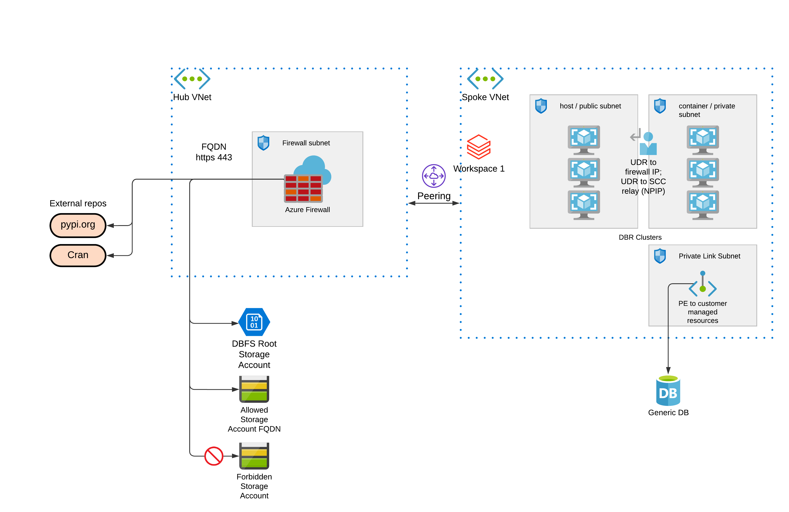

# Provisioning Azure Databricks workspace with a Hub & Spoke firewall for data exfiltration protection

This template provides an example deployment of: Hub-Spoke networking with egress firewall to control all outbound traffic from Databricks subnets. Details are described in: https://databricks.com/blog/2020/03/27/data-exfiltration-protection-with-azure-databricks.html

With this setup, you can setup firewall rules to block / allow egress traffic from your Databricks clusters. You can also use firewall to block all access to storage accounts, and use private endpoint connection to bypass this firewall, such that you allow access only to specific storage accounts.  

To find IP and FQDN for your deployment, go to: https://docs.microsoft.com/en-us/azure/databricks/administration-guide/cloud-configurations/azure/udr

## Overall Architecture

Resources to be created:
* Resource group with random prefix
* Tags, including `Owner`, which is taken from `az account show --query user`
* Hub-Spoke topology, with hub firewall in hub vnet's subnet.
* Associated firewall rules, both FQDN and network rule using IP.

## Getting Started
1. Clone this repo to your local machine running terraform.
2. Run `terraform init` to initialize terraform and get provider ready.
3. Change `terraform.tfvars` values to your own values.
4. Inside the local project folder, run `terraform apply` to create the resources.

## How to fill in variable values

Most of the values are to be found at: https://docs.microsoft.com/en-us/azure/databricks/administration-guide/cloud-configurations/azure/udr

In `variables.tfvars`, set these variables:

metastoreip      = "40.78.233.2" # find your metastore service ip

sccip            = "52.230.27.216" # use nslookup on the domain name to find the ip

webappip         = "52.187.145.107/32" # given at UDR page

firewallfqdn = ["dbartifactsprodseap.blob.core.windows.net","dbartifactsprodeap.blob.core.windows.net","dblogprodseasia.blob.core.windows.net","prod-southeastasia-observabilityeventhubs.servicebus.windows.net","cdnjs.com"] # find these for your region, follow Databricks blog tutorial.

<!-- BEGIN_TF_DOCS -->
## Requirements

| Name                                                                         | Version |
| ---------------------------------------------------------------------------- | ------- |
|  [azurerm](#requirement\_azurerm)          | =2.83.0 |
|  [databricks](#requirement\_databricks) | 0.3.10  |

## Providers

| Name                                                             | Version |
| ---------------------------------------------------------------- | ------- |
|  [azurerm](#provider\_azurerm)    | 2.83.0  |
|  [external](#provider\_external) | 2.2.0   |
|  [random](#provider\_random)       | 3.1.0   |

## Modules

No modules.

## Resources

| Name                                                                                                                                                                                   | Type        |
| -------------------------------------------------------------------------------------------------------------------------------------------------------------------------------------- | ----------- |
| [azurerm_databricks_workspace.this](https://registry.terraform.io/providers/hashicorp/azurerm/2.83.0/docs/resources/databricks_workspace)                                              | resource    |
| [azurerm_firewall.hubfw](https://registry.terraform.io/providers/hashicorp/azurerm/2.83.0/docs/resources/firewall)                                                                     | resource    |
| [azurerm_firewall_application_rule_collection.adbfqdn](https://registry.terraform.io/providers/hashicorp/azurerm/2.83.0/docs/resources/firewall_application_rule_collection)           | resource    |
| [azurerm_firewall_network_rule_collection.adbfnetwork](https://registry.terraform.io/providers/hashicorp/azurerm/2.83.0/docs/resources/firewall_network_rule_collection)               | resource    |
| [azurerm_network_security_group.this](https://registry.terraform.io/providers/hashicorp/azurerm/2.83.0/docs/resources/network_security_group)                                          | resource    |
| [azurerm_public_ip.fwpublicip](https://registry.terraform.io/providers/hashicorp/azurerm/2.83.0/docs/resources/public_ip)                                                              | resource    |
| [azurerm_resource_group.this](https://registry.terraform.io/providers/hashicorp/azurerm/2.83.0/docs/resources/resource_group)                                                          | resource    |
| [azurerm_route_table.adbroute](https://registry.terraform.io/providers/hashicorp/azurerm/2.83.0/docs/resources/route_table)                                                            | resource    |
| [azurerm_storage_account.allowedstorage](https://registry.terraform.io/providers/hashicorp/azurerm/2.83.0/docs/resources/storage_account)                                              | resource    |
| [azurerm_storage_account.deniedstorage](https://registry.terraform.io/providers/hashicorp/azurerm/2.83.0/docs/resources/storage_account)                                               | resource    |
| [azurerm_subnet.hubfw](https://registry.terraform.io/providers/hashicorp/azurerm/2.83.0/docs/resources/subnet)                                                                         | resource    |
| [azurerm_subnet.plsubnet](https://registry.terraform.io/providers/hashicorp/azurerm/2.83.0/docs/resources/subnet)                                                                      | resource    |
| [azurerm_subnet.private](https://registry.terraform.io/providers/hashicorp/azurerm/2.83.0/docs/resources/subnet)                                                                       | resource    |
| [azurerm_subnet.public](https://registry.terraform.io/providers/hashicorp/azurerm/2.83.0/docs/resources/subnet)                                                                        | resource    |
| [azurerm_subnet_network_security_group_association.private](https://registry.terraform.io/providers/hashicorp/azurerm/2.83.0/docs/resources/subnet_network_security_group_association) | resource    |
| [azurerm_subnet_network_security_group_association.public](https://registry.terraform.io/providers/hashicorp/azurerm/2.83.0/docs/resources/subnet_network_security_group_association)  | resource    |
| [azurerm_subnet_route_table_association.privateudr](https://registry.terraform.io/providers/hashicorp/azurerm/2.83.0/docs/resources/subnet_route_table_association)                    | resource    |
| [azurerm_subnet_route_table_association.publicudr](https://registry.terraform.io/providers/hashicorp/azurerm/2.83.0/docs/resources/subnet_route_table_association)                     | resource    |
| [azurerm_virtual_network.hubvnet](https://registry.terraform.io/providers/hashicorp/azurerm/2.83.0/docs/resources/virtual_network)                                                     | resource    |
| [azurerm_virtual_network.this](https://registry.terraform.io/providers/hashicorp/azurerm/2.83.0/docs/resources/virtual_network)                                                        | resource    |
| [azurerm_virtual_network_peering.hubvnet](https://registry.terraform.io/providers/hashicorp/azurerm/2.83.0/docs/resources/virtual_network_peering)                                     | resource    |
| [azurerm_virtual_network_peering.spokevnet](https://registry.terraform.io/providers/hashicorp/azurerm/2.83.0/docs/resources/virtual_network_peering)                                   | resource    |
| [random_string.naming](https://registry.terraform.io/providers/hashicorp/random/latest/docs/resources/string)                                                                          | resource    |
| [azurerm_client_config.current](https://registry.terraform.io/providers/hashicorp/azurerm/2.83.0/docs/data-sources/client_config)                                                      | data source |
| [external_external.me](https://registry.terraform.io/providers/hashicorp/external/latest/docs/data-sources/external)                                                                   | data source |

## Inputs

| Name                                                                                                           | Description | Type        | Default           | Required |
| -------------------------------------------------------------------------------------------------------------- | ----------- | ----------- | ----------------- | :------: |
|  [dbfs\_prefix](#input\_dbfs\_prefix)                                          | n/a         | `string`    | `"dbfs"`          |    no    |
|  [firewallfqdn](#input\_firewallfqdn)                                         | n/a         | `list(any)` | n/a               |   yes    |
|  [hubcidr](#input\_hubcidr)                                                        | n/a         | `string`    | `"10.178.0.0/20"` |    no    |
|  [metastoreip](#input\_metastoreip)                                            | n/a         | `string`    | n/a               |   yes    |
|  [no\_public\_ip](#input\_no\_public\_ip)                                     | n/a         | `bool`      | `true`            |    no    |
|  [private\_subnet\_endpoints](#input\_private\_subnet\_endpoints) | n/a         | `list`      | `[]`              |    no    |
|  [rglocation](#input\_rglocation)                                               | n/a         | `string`    | `"southeastasia"` |    no    |
|  [sccip](#input\_sccip)                                                              | n/a         | `string`    | n/a               |   yes    |
|  [spokecidr](#input\_spokecidr)                                                  | n/a         | `string`    | `"10.179.0.0/20"` |    no    |
|  [webappip](#input\_webappip)                                                     | n/a         | `string`    | n/a               |   yes    |
|  [workspace\_prefix](#input\_workspace\_prefix)                           | n/a         | `string`    | `"adb"`           |    no    |

## Outputs

| Name                                                                                                                                                           | Description |
| -------------------------------------------------------------------------------------------------------------------------------------------------------------- | ----------- |
|  [arm\_client\_id](#output\_arm\_client\_id)                                                                                | n/a         |
|  [arm\_subscription\_id](#output\_arm\_subscription\_id)                                                              | n/a         |
|  [arm\_tenant\_id](#output\_arm\_tenant\_id)                                                                                | n/a         |
|  [azure\_region](#output\_azure\_region)                                                                                     | n/a         |
|  [databricks\_azure\_workspace\_resource\_id](#output\_databricks\_azure\_workspace\_resource\_id) | n/a         |
|  [resource\_group](#output\_resource\_group)                                                                               | n/a         |
|  [workspace\_url](#output\_workspace\_url)                                                                                  | n/a         |
<!-- END_TF_DOCS -->