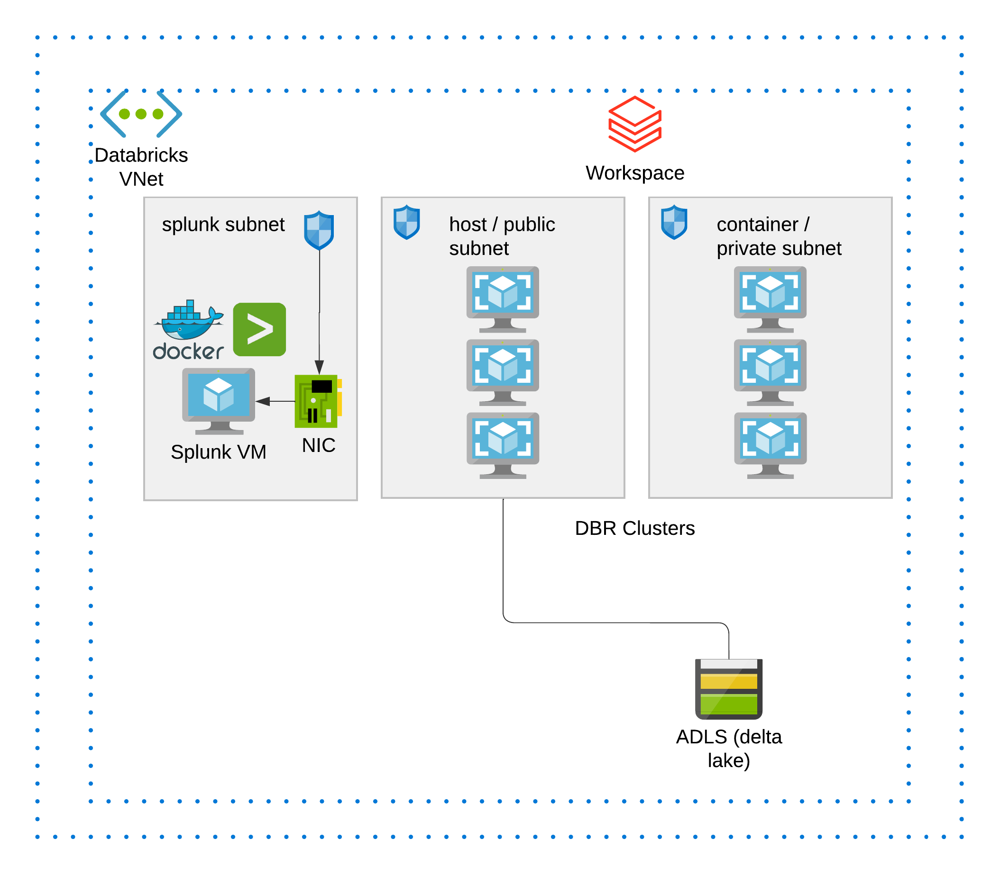
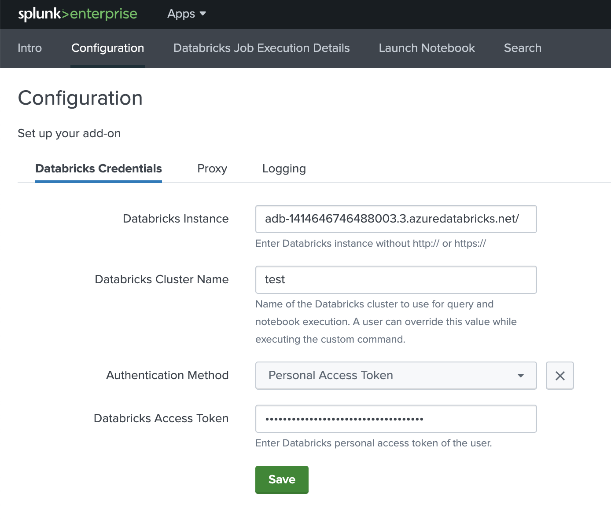

# Splunk-Databricks integration pattern and quick setup

This demo is a collaborative work with jerrold.law@databricks.com.

This is an automated terraform template to deploy Databricks workspace and a VM hosting Splunk (deployed docker image https://hub.docker.com/r/splunk/splunk/), and integrate Splunk-Databricks.

## Overall Architecture

## Context

Please read the source repo:
https://github.com/databrickslabs/splunk-integration

Quote: *The Databricks add-on for Splunk, an app, that allows Splunk Enterprise and Splunk Cloud users to run queries and execute actions, such as running notebooks and jobs, in Databricks.*

What you can do using this integration app? (Quoted from source repo)

1. Run Databricks SQL queries right from the Splunk search bar and see the results in Splunk UI.
2. Execute actions in Databricks, such as notebook runs and jobs, from Splunk.
3. Use Splunk SQL database extension to integrate Databricks information with Splunk queries and reports.
4. Push events, summary, alerts to Splunk from Databricks.
5. Pull events, alerts data from Splunk into Databricks.

## Getting started
### Step 1:

Clone this repo to your local, and make sure you have installed Terraform on your machine. See https://learn.hashicorp.com/tutorials/terraform/install-cli on how to install terraform on your machine.

### Step 2:

Navigate to this folder `/adb-splunk`, run `terraform init` and `terraform apply` then type yes when prompted. This will deploy the infra to your Azure subscription, specifically it deploys a resource group, a vnet with 3 subnets inside, a databricks workspace, a vm, and a storage account.

### Step 3:

There will be an output id address, use that to replace the public ip in http://20.212.33.56:8000, then login using default username and password:
`admin` and `password`, this brings you to the Splunk VM landing page.

### Step 4:

Logged into Splunk vm UI, then go to Databricks connector, follow the instructuions to interact with Databricks clusters from within Splunk.

### Step 5:

(Clean up resources) To remove all resources, run `terraform destroy`.

<!-- BEGIN_TF_DOCS -->
## Requirements

| Name                                                                         | Version  |
| ---------------------------------------------------------------------------- | -------- |
|  [azurerm](#requirement\_azurerm)          | >=2.83.0 |
|  [databricks](#requirement\_databricks) | >=0.5.1  |
|  [tls](#requirement\_tls)                      | >= 3.1   |

## Providers

| Name                                                             | Version |
| ---------------------------------------------------------------- | ------- |
|  [azurerm](#provider\_azurerm)    | 3.11.0  |
|  [external](#provider\_external) | 2.2.2   |
|  [local](#provider\_local)          | 2.2.3   |
|  [random](#provider\_random)       | 3.3.2   |
|  [tls](#provider\_tls)                | 3.4.0   |

## Modules

| Name                                                                       | Source                 | Version |
| -------------------------------------------------------------------------- | ---------------------- | ------- |
|  [adls\_content](#module\_adls\_content) | ./modules/adls_content | n/a     |

## Resources

| Name                                                                                                                                                                                   | Type        |
| -------------------------------------------------------------------------------------------------------------------------------------------------------------------------------------- | ----------- |
| [azurerm_databricks_workspace.this](https://registry.terraform.io/providers/hashicorp/azurerm/latest/docs/resources/databricks_workspace)                                              | resource    |
| [azurerm_linux_virtual_machine.example](https://registry.terraform.io/providers/hashicorp/azurerm/latest/docs/resources/linux_virtual_machine)                                         | resource    |
| [azurerm_network_interface.splunk-nic](https://registry.terraform.io/providers/hashicorp/azurerm/latest/docs/resources/network_interface)                                              | resource    |
| [azurerm_network_security_group.this](https://registry.terraform.io/providers/hashicorp/azurerm/latest/docs/resources/network_security_group)                                          | resource    |
| [azurerm_public_ip.splunk-nic-pubip](https://registry.terraform.io/providers/hashicorp/azurerm/latest/docs/resources/public_ip)                                                        | resource    |
| [azurerm_resource_group.this](https://registry.terraform.io/providers/hashicorp/azurerm/latest/docs/resources/resource_group)                                                          | resource    |
| [azurerm_storage_blob.splunk_databricks_app_file](https://registry.terraform.io/providers/hashicorp/azurerm/latest/docs/resources/storage_blob)                                        | resource    |
| [azurerm_storage_blob.splunk_setup_file](https://registry.terraform.io/providers/hashicorp/azurerm/latest/docs/resources/storage_blob)                                                 | resource    |
| [azurerm_subnet.private](https://registry.terraform.io/providers/hashicorp/azurerm/latest/docs/resources/subnet)                                                                       | resource    |
| [azurerm_subnet.public](https://registry.terraform.io/providers/hashicorp/azurerm/latest/docs/resources/subnet)                                                                        | resource    |
| [azurerm_subnet.splunksubnet](https://registry.terraform.io/providers/hashicorp/azurerm/latest/docs/resources/subnet)                                                                  | resource    |
| [azurerm_subnet_network_security_group_association.private](https://registry.terraform.io/providers/hashicorp/azurerm/latest/docs/resources/subnet_network_security_group_association) | resource    |
| [azurerm_subnet_network_security_group_association.public](https://registry.terraform.io/providers/hashicorp/azurerm/latest/docs/resources/subnet_network_security_group_association)  | resource    |
| [azurerm_virtual_machine_extension.splunksetupagent](https://registry.terraform.io/providers/hashicorp/azurerm/latest/docs/resources/virtual_machine_extension)                        | resource    |
| [azurerm_virtual_network.this](https://registry.terraform.io/providers/hashicorp/azurerm/latest/docs/resources/virtual_network)                                                        | resource    |
| [local_file.private_key](https://registry.terraform.io/providers/hashicorp/local/latest/docs/resources/file)                                                                           | resource    |
| [local_file.setupscript](https://registry.terraform.io/providers/hashicorp/local/latest/docs/resources/file)                                                                           | resource    |
| [random_string.naming](https://registry.terraform.io/providers/hashicorp/random/latest/docs/resources/string)                                                                          | resource    |
| [tls_private_key.splunk_ssh](https://registry.terraform.io/providers/hashicorp/tls/latest/docs/resources/private_key)                                                                  | resource    |
| [azurerm_client_config.current](https://registry.terraform.io/providers/hashicorp/azurerm/latest/docs/data-sources/client_config)                                                      | data source |
| [external_external.me](https://registry.terraform.io/providers/hashicorp/external/latest/docs/data-sources/external)                                                                   | data source |

## Inputs

| Name                                                                                                           | Description | Type     | Default           | Required |
| -------------------------------------------------------------------------------------------------------------- | ----------- | -------- | ----------------- | :------: |
|  [dbfs\_prefix](#input\_dbfs\_prefix)                                          | n/a         | `string` | `"dbfs"`          |    no    |
|  [no\_public\_ip](#input\_no\_public\_ip)                                     | n/a         | `bool`   | `true`            |    no    |
|  [private\_subnet\_endpoints](#input\_private\_subnet\_endpoints) | n/a         | `list`   | `[]`              |    no    |
|  [rglocation](#input\_rglocation)                                               | n/a         | `string` | `"southeastasia"` |    no    |
|  [spokecidr](#input\_spokecidr)                                                  | n/a         | `string` | `"10.179.0.0/20"` |    no    |
|  [workspace\_prefix](#input\_workspace\_prefix)                           | n/a         | `string` | `"adb"`           |    no    |

## Outputs

| Name                                                                                                                                                           | Description |
| -------------------------------------------------------------------------------------------------------------------------------------------------------------- | ----------- |
|  [databricks\_azure\_workspace\_resource\_id](#output\_databricks\_azure\_workspace\_resource\_id) | n/a         |
|  [splunk\_public\_ip](#output\_splunk\_public\_ip)                                                                       | n/a         |
|  [workspace\_url](#output\_workspace\_url)                                                                                  | n/a         |
<!-- END_TF_DOCS -->