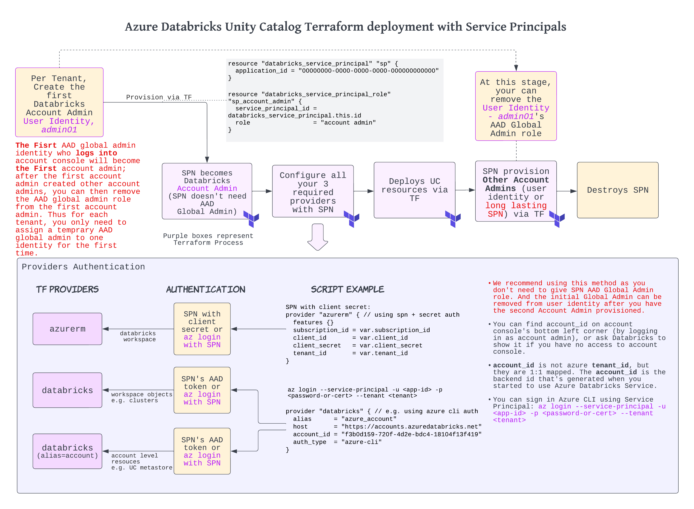

## Azure Databricks Unity Catalog Examples

This folder shows how to automate ADB UC resources deployment using Service Principal authentication. In stage 1 we create an AAD Global Admin SPN, in stage 2 we make this SPN the first Databricks account admin, and in stage 3 we use the long lasting SPN to deploy UC resources.

The reason of having a 2-fold structure is that we can just have the first AAD Global Admin SPN temporarily deployed, at the moment of you have created the second Databricks account admin, you can safely remove the Global Admin role. Thus to minimize the priviledge footprint.

Go through this tutorial by sequence of stage 1 - 2 - 3 and modify the logic according to your existing scripts. 

The flowchart below shows how to get the first Databricks account admin, deploy UC resources using SPN, while minimizing the exposure of AAD Global Admin role:

