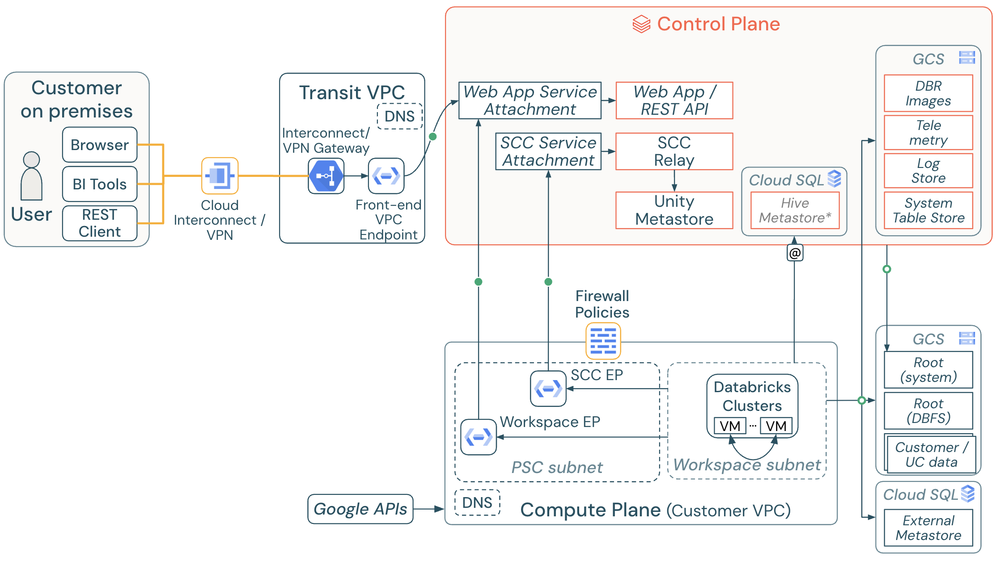

# Databricks on Google Cloud with Private Service Connect and Hub-Spoke network structure (data exfiltration protection).

Include:
1. Hub-Spoke networking with egress firewall to control all outbound traffic, e.g. to pypi.org.
2. Private Service Connect connection for backend traffic from data plane to control plane.
3. Private Service Connect connection from user client to webapp service.
4. Private Google Access from data plane to DBFS storage.
5. Private Service Connect connection for web-auth traffic.

Overall Architecture:

With this deployment, traffic from user client to webapp (notebook UI), backend traffic from data plane to control plane will be through PSC endpoints. This terraform sample will create:
* Hub VPC and its subnet
* Spoke VPC and its subnets
* Peering between Hub and Spoke VPC
* Private Service Connect (PSC) endpoints
* DNS private and peering zones
* Firewall rules for Hub and Spoke VPCs
* Databricks workspace with private link to control plane, user to webapp and private link to DBFS

**REMARK THAT** the module does not contain the VPC SC implementation. This can be added to increase the security level in the Databricks deployment, providing detailed access level for ingress and egress traffic.

## How to use

> **Note**  
> You can customize this module by adding, deleting or updating the Google Cloud resources to adapt the module to your requirements.
> A deployment example using this module can be found in [examples/gcp-with-psc-exfiltration-protection](../../examples/gcp-with-psc-exfiltration-protection)

1. Reference this module using one of the different [module source types](https://developer.hashicorp.com/terraform/language/modules/sources)
2. Add `terraform.tfvars` with the information about service principals to be provisioned at account level.

<!-- BEGIN_TF_DOCS -->
## Requirements

No requirements.

## Providers

| Name                                                                   | Version |
|------------------------------------------------------------------------|---------|
|  [databricks](#provider\_databricks) | n/a     |
|  [google](#provider\_google)             | n/a     |
|  [random](#provider\_random)             | n/a     |

## Modules

No modules.

## Resources

| Name                                                                                                                                                                   | Type     |
|------------------------------------------------------------------------------------------------------------------------------------------------------------------------|----------|
| [databricks_mws_networks.databricks_network](https://registry.terraform.io/providers/databricks/databricks/latest/docs/resources/mws_networks)                         | resource |
| [databricks_mws_private_access_settings.pas](https://registry.terraform.io/providers/databricks/databricks/latest/docs/resources/mws_private_access_settings)          | resource |
| [databricks_mws_vpc_endpoint.backend_endpoint](https://registry.terraform.io/providers/databricks/databricks/latest/docs/resources/mws_vpc_endpoint)                   | resource |
| [databricks_mws_vpc_endpoint.frontend_endpoint](https://registry.terraform.io/providers/databricks/databricks/latest/docs/resources/mws_vpc_endpoint)                  | resource |
| [databricks_mws_vpc_endpoint.transit_endpoint](https://registry.terraform.io/providers/databricks/databricks/latest/docs/resources/mws_vpc_endpoint)                   | resource |
| [databricks_mws_workspaces.databricks_workspace](https://registry.terraform.io/providers/databricks/databricks/latest/docs/resources/mws_workspaces)                   | resource |
| [google_compute_address.backend_pe_ip_address](https://registry.terraform.io/providers/hashicorp/google/latest/docs/resources/compute_address)                         | resource |
| [google_compute_address.hub_frontend_pe_ip_address](https://registry.terraform.io/providers/hashicorp/google/latest/docs/resources/compute_address)                    | resource |
| [google_compute_address.spoke_frontend_pe_ip_address](https://registry.terraform.io/providers/hashicorp/google/latest/docs/resources/compute_address)                  | resource |
| [google_compute_firewall.databricks_workspace_traffic](https://registry.terraform.io/providers/hashicorp/google/latest/docs/resources/compute_firewall)                | resource |
| [google_compute_firewall.default_deny_egress](https://registry.terraform.io/providers/hashicorp/google/latest/docs/resources/compute_firewall)                         | resource |
| [google_compute_firewall.from_gcp_health_checks](https://registry.terraform.io/providers/hashicorp/google/latest/docs/resources/compute_firewall)                      | resource |
| [google_compute_firewall.hub_net_traffic](https://registry.terraform.io/providers/hashicorp/google/latest/docs/resources/compute_firewall)                             | resource |
| [google_compute_firewall.to_databricks_control_plane](https://registry.terraform.io/providers/hashicorp/google/latest/docs/resources/compute_firewall)                 | resource |
| [google_compute_firewall.to_gcp_health_checks](https://registry.terraform.io/providers/hashicorp/google/latest/docs/resources/compute_firewall)                        | resource |
| [google_compute_firewall.to_gke_master](https://registry.terraform.io/providers/hashicorp/google/latest/docs/resources/compute_firewall)                               | resource |
| [google_compute_firewall.to_gke_nodes_subnet](https://registry.terraform.io/providers/hashicorp/google/latest/docs/resources/compute_firewall)                         | resource |
| [google_compute_firewall.to_google_apis](https://registry.terraform.io/providers/hashicorp/google/latest/docs/resources/compute_firewall)                              | resource |
| [google_compute_firewall.to_managed_hive](https://registry.terraform.io/providers/hashicorp/google/latest/docs/resources/compute_firewall)                             | resource |
| [google_compute_forwarding_rule.backend_psc_ep](https://registry.terraform.io/providers/hashicorp/google/latest/docs/resources/compute_forwarding_rule)                | resource |
| [google_compute_forwarding_rule.hub_frontend_psc_ep](https://registry.terraform.io/providers/hashicorp/google/latest/docs/resources/compute_forwarding_rule)           | resource |
| [google_compute_forwarding_rule.spoke_frontend_psc_ep](https://registry.terraform.io/providers/hashicorp/google/latest/docs/resources/compute_forwarding_rule)         | resource |
| [google_compute_network.hub_vpc](https://registry.terraform.io/providers/hashicorp/google/latest/docs/resources/compute_network)                                       | resource |
| [google_compute_network.spoke_vpc](https://registry.terraform.io/providers/hashicorp/google/latest/docs/resources/compute_network)                                     | resource |
| [google_compute_network_peering.hub_spoke_peering](https://registry.terraform.io/providers/hashicorp/google/latest/docs/resources/compute_network_peering)             | resource |
| [google_compute_network_peering.spoke_hub_peering](https://registry.terraform.io/providers/hashicorp/google/latest/docs/resources/compute_network_peering)             | resource |
| [google_compute_shared_vpc_host_project.host](https://registry.terraform.io/providers/hashicorp/google/latest/docs/resources/compute_shared_vpc_host_project)          | resource |
| [google_compute_shared_vpc_service_project.service](https://registry.terraform.io/providers/hashicorp/google/latest/docs/resources/compute_shared_vpc_service_project) | resource |
| [google_compute_subnetwork.hub_subnetwork](https://registry.terraform.io/providers/hashicorp/google/latest/docs/resources/compute_subnetwork)                          | resource |
| [google_compute_subnetwork.psc_subnetwork](https://registry.terraform.io/providers/hashicorp/google/latest/docs/resources/compute_subnetwork)                          | resource |
| [google_compute_subnetwork.spoke_subnetwork](https://registry.terraform.io/providers/hashicorp/google/latest/docs/resources/compute_subnetwork)                        | resource |
| [google_dns_managed_zone.gcr_peering_zone](https://registry.terraform.io/providers/hashicorp/google/latest/docs/resources/dns_managed_zone)                            | resource |
| [google_dns_managed_zone.gcr_private_zone](https://registry.terraform.io/providers/hashicorp/google/latest/docs/resources/dns_managed_zone)                            | resource |
| [google_dns_managed_zone.google_apis_peering_zone](https://registry.terraform.io/providers/hashicorp/google/latest/docs/resources/dns_managed_zone)                    | resource |
| [google_dns_managed_zone.google_apis_private_zone](https://registry.terraform.io/providers/hashicorp/google/latest/docs/resources/dns_managed_zone)                    | resource |
| [google_dns_managed_zone.hub_private_zone](https://registry.terraform.io/providers/hashicorp/google/latest/docs/resources/dns_managed_zone)                            | resource |
| [google_dns_managed_zone.pkg_dev_peering_zone](https://registry.terraform.io/providers/hashicorp/google/latest/docs/resources/dns_managed_zone)                        | resource |
| [google_dns_managed_zone.pkg_dev_private_zone](https://registry.terraform.io/providers/hashicorp/google/latest/docs/resources/dns_managed_zone)                        | resource |
| [google_dns_managed_zone.spoke_private_zone](https://registry.terraform.io/providers/hashicorp/google/latest/docs/resources/dns_managed_zone)                          | resource |
| [google_dns_record_set.gcr_a](https://registry.terraform.io/providers/hashicorp/google/latest/docs/resources/dns_record_set)                                           | resource |
| [google_dns_record_set.gcr_cname](https://registry.terraform.io/providers/hashicorp/google/latest/docs/resources/dns_record_set)                                       | resource |
| [google_dns_record_set.hub_workspace_dp](https://registry.terraform.io/providers/hashicorp/google/latest/docs/resources/dns_record_set)                                | resource |
| [google_dns_record_set.hub_workspace_psc_auth](https://registry.terraform.io/providers/hashicorp/google/latest/docs/resources/dns_record_set)                          | resource |
| [google_dns_record_set.hub_workspace_url](https://registry.terraform.io/providers/hashicorp/google/latest/docs/resources/dns_record_set)                               | resource |
| [google_dns_record_set.pkg_dev_a](https://registry.terraform.io/providers/hashicorp/google/latest/docs/resources/dns_record_set)                                       | resource |
| [google_dns_record_set.pkg_dev_cname](https://registry.terraform.io/providers/hashicorp/google/latest/docs/resources/dns_record_set)                                   | resource |
| [google_dns_record_set.restricted_apis_a](https://registry.terraform.io/providers/hashicorp/google/latest/docs/resources/dns_record_set)                               | resource |
| [google_dns_record_set.restricted_apis_cname](https://registry.terraform.io/providers/hashicorp/google/latest/docs/resources/dns_record_set)                           | resource |
| [google_dns_record_set.spoke_relay](https://registry.terraform.io/providers/hashicorp/google/latest/docs/resources/dns_record_set)                                     | resource |
| [google_dns_record_set.spoke_workspace_dp](https://registry.terraform.io/providers/hashicorp/google/latest/docs/resources/dns_record_set)                              | resource |
| [google_dns_record_set.spoke_workspace_url](https://registry.terraform.io/providers/hashicorp/google/latest/docs/resources/dns_record_set)                             | resource |
| [random_string.suffix](https://registry.terraform.io/providers/hashicorp/random/latest/docs/resources/string)                                                          | resource |

## Inputs

| Name                                                                                                             | Description                                             | Type          | Default | Required |
|------------------------------------------------------------------------------------------------------------------|---------------------------------------------------------|---------------|---------|:--------:|
|  [databricks\_account\_id](#input\_databricks\_account\_id)            | Databricks Account ID                                   | `string`      | n/a     |   yes    |
|  [gke\_master\_ip\_range](#input\_gke\_master\_ip\_range)                | IP Range for GKE Master subnet                          | `string`      | n/a     |   yes    |
|  [google\_region](#input\_google\_region)                                      | Google Cloud region where the resources will be created | `string`      | n/a     |   yes    |
|  [hive\_metastore\_ip](#input\_hive\_metastore\_ip)                        | Value of regional default Hive Metastore IP             | `string`      | n/a     |   yes    |
|  [hub\_vpc\_cidr](#input\_hub\_vpc\_cidr)                                       | CIDR for Hub VPC                                        | `string`      | n/a     |   yes    |
|  [hub\_vpc\_google\_project](#input\_hub\_vpc\_google\_project)       | Google Cloud project ID related to Hub VPC              | `string`      | n/a     |   yes    |
|  [is\_spoke\_vpc\_shared](#input\_is\_spoke\_vpc\_shared)                | Whether the Spoke VPC is a Shared or a dedicated VPC    | `bool`        | n/a     |   yes    |
|  [pod\_ip\_cidr\_range](#input\_pod\_ip\_cidr\_range)                      | IP Range for Pods subnet (secondary)                    | `string`      | n/a     |   yes    |
|  [prefix](#input\_prefix)                                                             | Prefix to use in generated resources name               | `string`      | n/a     |   yes    |
|  [psc\_subnet\_cidr](#input\_psc\_subnet\_cidr)                              | CIDR for Spoke VPC                                      | `string`      | n/a     |   yes    |
|  [service\_ip\_cidr\_range](#input\_service\_ip\_cidr\_range)          | IP Range for Services subnet (secondary)                | `string`      | n/a     |   yes    |
|  [spoke\_vpc\_cidr](#input\_spoke\_vpc\_cidr)                                 | CIDR for Spoke VPC                                      | `string`      | n/a     |   yes    |
|  [spoke\_vpc\_google\_project](#input\_spoke\_vpc\_google\_project) | Google Cloud project ID related to Spoke VPC            | `string`      | n/a     |   yes    |
|  [tags](#input\_tags)                                                                   | Map of tags to add to all resources                     | `map(string)` | n/a     |   yes    |
|  [workspace\_google\_project](#input\_workspace\_google\_project)   | Google Cloud project ID related to Databricks workspace | `string`      | n/a     |   yes    |

## Outputs

| Name                                                                          | Description                                                                          |
|-------------------------------------------------------------------------------|--------------------------------------------------------------------------------------|
|  [workspace\_id](#output\_workspace\_id)    | The Databricks workspace ID                                                          |
|  [workspace\_url](#output\_workspace\_url) | The workspace URL which is of the format '{workspaceId}.{random}.gcp.databricks.com' |
<!-- END_TF_DOCS -->